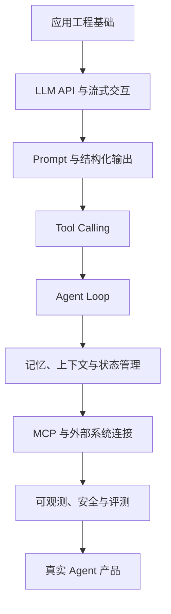
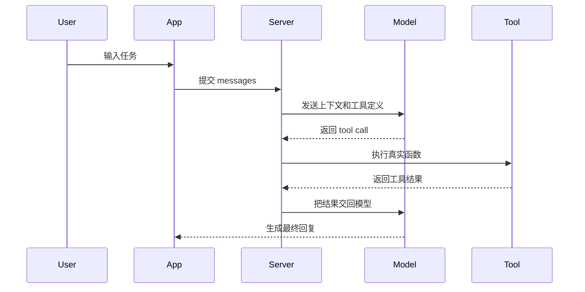

# Agent 开发学习路径

Agent 开发不是“会调一个大模型接口”就结束了，而是要把模型、工具、状态、权限、评测和产品体验组合成一个可运行的系统。它既需要应用开发能力，也需要后端工程、数据工程、产品设计、安全治理和持续评测。

这条路线可以按 8 个阶段推进：



## 阶段一：补齐应用工程底座

目标：能独立做出一个稳定的 AI 应用原型，并知道哪些能力应该放在客户端、服务端和外部系统里。

重点能力：

- 编程语言：TypeScript 或 Python 至少熟练一种。
- Web 基础：HTTP、SSE、WebSocket、鉴权、跨域、错误处理。
- 服务端基础：API 设计、环境变量、日志、数据库、队列、任务重试。
- 数据建模：schema、JSON、结构化校验、版本兼容。
- 安全边界：API Key 不能暴露给用户，高风险动作不能让模型直接执行。

练手项目：

- 做一个普通 Chat 应用，支持历史消息、loading、错误重试。
- 做一个流式回答接口，能边生成边返回。
- 做一个带“停止生成”和“重新生成”的聊天页面或命令行工具。

推荐资源：

- [TypeScript Handbook](https://www.typescriptlang.org/docs/)
- [Python Docs](https://docs.python.org/3/)
- [MDN: HTTP](https://developer.mozilla.org/en-US/docs/Web/HTTP)
- [MDN: Server-sent events](https://developer.mozilla.org/en-US/docs/Web/API/Server-sent_events)
- [Zod Documentation](https://zod.dev/)

## 阶段二：理解 LLM API 和流式交互

目标：知道模型接口返回什么、应用如何承接、服务端如何封装。

你需要理解这几个问题：

- 模型输入为什么通常是 message 列表，而不是一个字符串。
- system/developer/user 等角色分别适合放什么信息。
- 流式输出如何传到调用方，如何中断，如何合并。
- token、上下文窗口、成本、延迟之间有什么关系。
- 为什么不能把所有历史消息无限塞回模型。

练手项目：

- 封装一个 `/api/chat` 或 CLI 命令，调用方只传 messages。
- 加上流式输出、停止生成、失败重试。
- 记录本次请求的耗时、模型、token 估算和错误信息。

推荐资源：

- [OpenAI API Docs](https://developers.openai.com/api/docs/)
- [OpenAI Prompt engineering](https://developers.openai.com/api/docs/guides/prompt-engineering)
- [Vercel AI SDK: Foundations](https://ai-sdk.dev/docs/foundations/overview)
- [Vercel AI SDK: Streaming](https://ai-sdk.dev/docs/foundations/streaming)

## 阶段三：Prompt、结构化输出和结果校验

目标：从“让模型自由回答”升级到“让模型产出可被程序消费的结果”。

Agent 产品里，模型输出经常要进入下一步流程，例如：

- 生成待办列表。
- 生成表单字段。
- 选择下一步工具。
- 判断是否需要追问。
- 生成结构化报告。

这时不能只依赖自然语言，需要用 schema 约束输出，并在服务端做校验。

练手项目：

- 输入一段需求，让模型输出结构化任务列表。
- 用 schema 定义输出结构，失败时自动重试或降级。
- 做一个“需求拆解器”：输入一句话，输出目标、约束、步骤、风险。

推荐资源：

- [OpenAI Structured Outputs](https://developers.openai.com/api/docs/guides/structured-outputs)
- [OpenAI Prompt engineering](https://developers.openai.com/api/docs/guides/prompt-engineering)
- [Vercel AI SDK: Generating Structured Data](https://ai-sdk.dev/docs/ai-sdk-core/generating-structured-data)
- [Pydantic](https://docs.pydantic.dev/)
- [Zod Documentation](https://zod.dev/)

## 阶段四：Tool Calling，让模型真正做事

目标：理解 Agent 的关键分界线：模型本身只会生成文本，真正改变外部世界的是工具。

Tool Calling 的本质流程是：



需要重点关注：

- 工具执行期间如何展示状态。
- 工具参数如何校验。
- 写操作、支付、删除、发消息等高风险动作是否需要用户确认。
- 工具失败后如何恢复。
- 工具是否幂等，重试会不会造成重复写入。

练手项目：

- 天气查询 Agent：模型决定是否调用 `getWeather(city)`。
- 日程助手：模型抽取时间、地点、标题，但真正创建前需要用户确认。
- 页面分析助手：输入 URL，工具抓取页面标题和摘要，模型总结。

推荐资源：

- [OpenAI Function calling](https://developers.openai.com/api/docs/guides/function-calling)
- [Vercel AI SDK: Tools and Tool Calling](https://ai-sdk.dev/docs/ai-sdk-core/tools-and-tool-calling)
- [LangChain.js Agents](https://docs.langchain.com/oss/javascript/langchain/agents)

## 阶段五：Agent Loop，从一次问答到多步任务

目标：理解 Agent 为什么不是“调一次模型”，而是“模型选择动作、执行工具、观察结果、继续决策”的循环。

一个最小 Agent Loop 可以这样理解：

```ts
while (!done && step < maxSteps) {
  const modelResult = await callModel({
    messages,
    tools,
  })

  if (modelResult.type === 'final') {
    return modelResult.text
  }

  const toolResult = await runTool(modelResult.toolCall)
  messages.push(modelResult.toolCall)
  messages.push(toolResult)
  step++
}
```

真实开发里要额外考虑：

- 最大步数，防止无限循环。
- 工具白名单，防止模型调用不存在或不该调用的工具。
- 幂等性，防止重试导致重复写入。
- 运行日志，方便回放每一步。
- 中断和恢复，用户可能不想等完整任务跑完。
- 多 Agent 协作时的职责边界和交接信息。

练手项目：

- 资料研究 Agent：搜索资料、读取网页、整理摘要、输出引用列表。
- Bug 排查 Agent：读取错误日志、搜索代码、给出可能原因和修复建议。
- 表单填写 Agent：理解用户目标，分步骤补齐缺失字段。

推荐资源：

- [OpenAI Agents SDK for TypeScript](https://openai.github.io/openai-agents-js/)
- [OpenAI Agents SDK: Running agents](https://developers.openai.com/api/docs/guides/agents/running-agents)
- [Vercel AI SDK: Agents](https://ai-sdk.dev/docs/agents)
- [LangChain.js Agents](https://docs.langchain.com/oss/javascript/langchain/agents)

## 阶段六：记忆、上下文和状态管理

目标：让 Agent 在多轮任务中“知道当前做到了哪里”，但又不会把所有东西都塞进上下文。

常见状态分层：

| 层级 | 保存什么 | 例子 |
| --- | --- | --- |
| 交互状态 | 当前输入、loading、工具执行状态 | UI store / CLI session |
| 会话状态 | 当前任务目标、已完成步骤、用户偏好 | conversation / session |
| 长期记忆 | 稳定偏好、项目背景、常用配置 | database / vector store |
| 外部上下文 | 文件、网页、数据库、业务系统 | MCP / tools |

要注意：聊天记录不等于记忆。聊天记录只是交互过程，记忆应该是被提炼、可检索、可更新的状态。

练手项目：

- 做一个学习助手，记住用户当前学习阶段和薄弱点。
- 做一个项目助手，能读取项目 README，并在多轮对话中围绕同一项目回答。
- 做一个“任务进度面板”，实时展示 Agent 当前目标、步骤和工具结果。

推荐资源：

- [OpenAI Conversation state](https://developers.openai.com/api/docs/guides/conversation-state)
- [OpenAI Compaction](https://developers.openai.com/api/docs/guides/compaction)
- [Vercel AI SDK: Chatbot Message Persistence](https://ai-sdk.dev/docs/ai-sdk-ui/chatbot-message-persistence)
- [Vercel AI SDK: Resume Streams](https://ai-sdk.dev/docs/ai-sdk-ui/chatbot-resume-streams)

## 阶段七：MCP，把工具能力标准化

目标：理解 MCP 的价值：让 Agent 用统一协议连接文件、数据库、搜索、浏览器、内部系统，而不是每个应用都重新写一套工具接入方式。

可以这样理解：

```text
Agent Client
  -> MCP Client
  -> MCP Server
  -> 外部系统：文件 / 数据库 / API / 浏览器 / 设计工具
```

为什么要学 MCP：

- 可以理解 Codex、Cursor、Claude Desktop 这类工具为什么能接入外部能力。
- 可以把自己的业务系统暴露成标准工具，给不同 Agent 复用。
- 可以设计更清楚的工具权限、输入 schema 和用户确认流程。

练手项目：

- 写一个本地 MCP Server，暴露 `listNotes`、`readNote`、`createNote`。
- 给一个项目做 MCP 工具：读取目录结构、查询依赖信息、读取指定文件摘要。
- 把工具调用结果展示成可交互 UI、CLI 输出或结构化报告，而不是只显示文本。

推荐资源：

- [Model Context Protocol: Introduction](https://modelcontextprotocol.io/docs/getting-started/intro)
- [Model Context Protocol: Build an MCP server](https://modelcontextprotocol.io/docs/develop/build-server)
- [MCP TypeScript SDK](https://github.com/modelcontextprotocol/typescript-sdk)
- [OpenAI MCP and connectors](https://developers.openai.com/api/docs/guides/tools-connectors-mcp)

## 阶段八：可观测、安全和评测

目标：让 Agent 从 demo 变成可上线的产品。

Agent 的线上问题通常不是“模型完全不会”，而是：

- 偶发调用错工具。
- 工具参数看似合理但实际有风险。
- 多步任务中间某一步失败后状态不一致。
- 成本、延迟、失败率不可控。
- 用户不知道 Agent 当前在做什么。

需要建立的工程能力：

- Trace：记录每轮模型输入输出、工具调用、工具结果。
- Evals：用固定测试集评估回答质量和工具选择。
- Guardrails：对输入、工具参数、输出做安全检查。
- Human-in-the-loop：高风险动作必须用户确认。
- Cost control：限制最大步数、最大 token、最大工具调用次数。

练手项目：

- 给 Agent 加一个运行详情面板，展示每一步模型和工具行为。
- 建一个 20 条测试集，每次改 prompt 后跑一遍。
- 给写操作工具加用户确认和撤销机制。

推荐资源：

- [OpenAI Evals](https://developers.openai.com/api/docs/guides/evals)
- [OpenAI Guardrails and human review](https://developers.openai.com/api/docs/guides/agents/guardrails-approvals)
- [OpenAI Integrations and observability](https://developers.openai.com/api/docs/guides/agents/integrations-observability)
- [Vercel AI SDK DevTools](https://ai-sdk.dev/docs/agents)
- [LangChain.js Guardrails and Human-in-the-loop](https://docs.langchain.com/oss/javascript/langchain/agents)

## 推荐实战路线

如果按 6 到 8 周推进，可以这样排：

| 周期 | 主题 | 产出 |
| --- | --- | --- |
| 第 1 周 | Chat + 流式输出 | 一个可中断的流式聊天应用 |
| 第 2 周 | Prompt + 结构化输出 | 一个需求拆解器 |
| 第 3 周 | Tool Calling | 一个能调用 2 到 3 个工具的小助手 |
| 第 4 周 | Agent Loop | 一个能多步完成任务的研究助手 |
| 第 5 周 | 记忆和状态 | 一个能恢复任务进度的助手 |
| 第 6 周 | MCP | 一个本地 MCP Server 和接入示例 |
| 第 7 周 | 可观测和评测 | trace 面板 + 小型 eval 集 |
| 第 8 周 | 产品化整合 | 一个可演示的 Agent 应用 |

## 最终项目建议

做一个“项目学习 Agent”很适合作为收口项目：

功能范围：

- 输入 GitHub 仓库、本地项目说明或文档集合。
- Agent 读取 README、目录结构和依赖信息。
- 自动生成学习路线、模块地图和关键文件解释。
- 用户可以追问某个模块、某个依赖、某条构建命令。
- 高风险动作只读不写；如果要写文件，必须用户确认。

这个项目能覆盖 Agent 开发的大部分核心能力：流式交互、结构化输出、工具调用、上下文管理、MCP、可观测、权限边界。做完它，基本就从“会用 AI API”跨到了“能设计 Agent 产品”的阶段。
