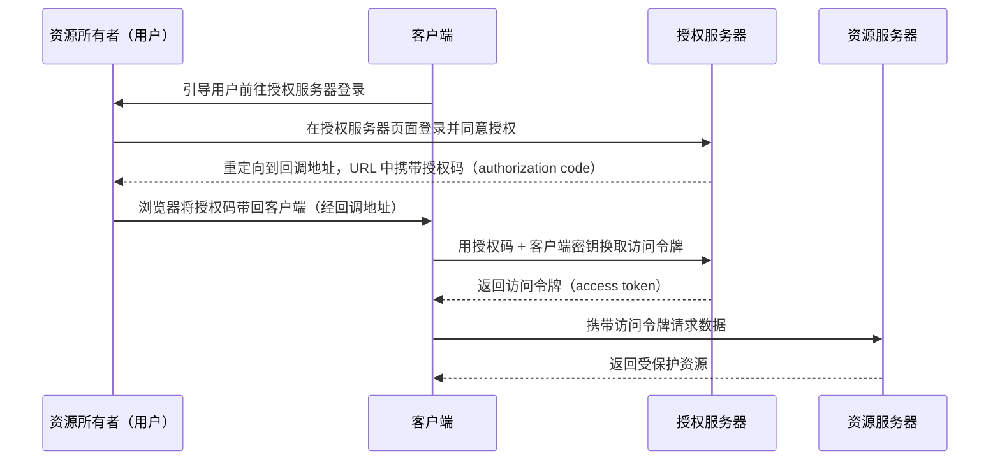
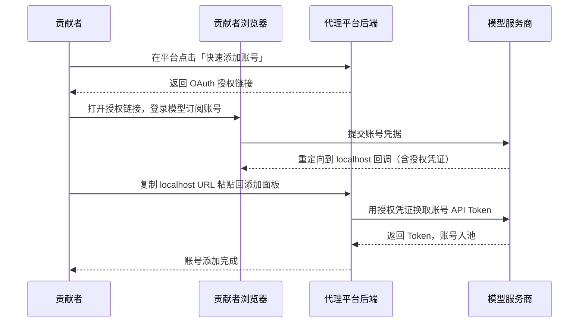
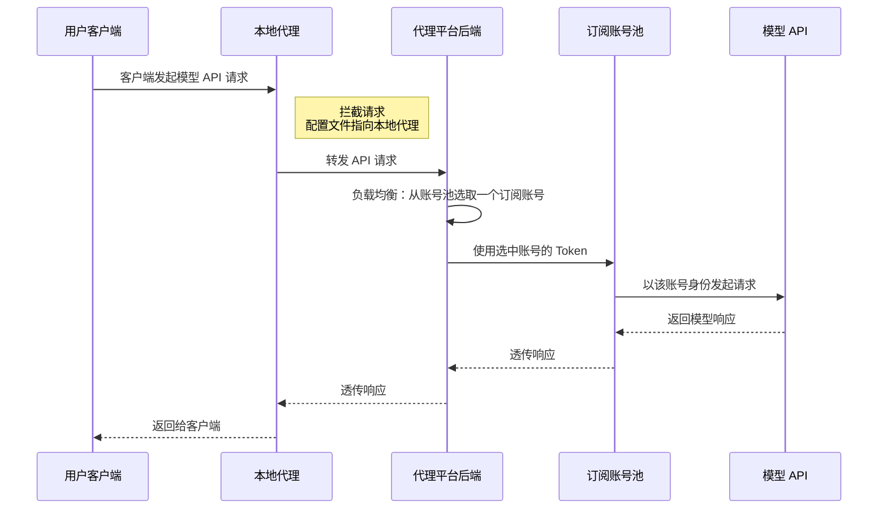

# 共享账号原理分析

## 一、整体架构

这类方案的核心思路是：将多个大模型订阅账号（如 GPT Pro、Claude Pro 等）池化后，通过代理平台对外提供统一的 API 入口，配合负载均衡实现"多人共享多个订阅账号"的效果。用户无需自己持有订阅账号，只需通过本地客户端代理即可使用。

整体数据流如下：

```
用户客户端 → 本地代理 → 代理平台后端（负载均衡）→ 订阅账号池 → 模型 API
                                    ↑
                          贡献者通过 OAuth 授权加入账号
```

这类方案同时具备两种代理角色：

- 对用户客户端而言是**正向代理**：拦截客户端发往模型 API 的请求并转发到代理平台后端
- 对账号池而言是**反向代理**：将请求负载均衡到不同的订阅账号

## 二、账号贡献与授权流程（OAuth 机制）

账号共享的核心是一个类似 OAuth 2.0 授权码流程的过程：

1. 平台生成一个授权链接，贡献者在浏览器中打开该链接并登录自己的模型订阅账号
2. 完成登录后，服务商会重定向到一个 `localhost` 的回调地址（页面打不开是正常的）
3. 这个 localhost URL 中包含了授权凭证（authorization code）
4. 贡献者将这个 localhost URL 复制粘贴回代理平台的账号添加面板
5. 后端从 URL 中提取凭证，完成账号信息的获取和存储

这样，平台就拿到了贡献者账号的 API 调用凭证，可以代为发起请求。

### OAuth 2.0 授权码模式简介

OAuth 2.0 是一个行业标准的**授权框架**，允许用户在不泄露密码的前提下，让第三方应用获取对自己资源的有限访问权限。其中涉及四个关键角色：

**资源所有者（Resource Owner）** 就是资源的拥有者，有权决定谁能访问自己的数据。

**客户端（Client）** 想要访问数据的第三方应用。

**授权服务器（Authorization Server）** 负责验证用户身份并签发访问令牌（Access Token）。

**资源服务器（Resource Server）** 存储实际数据的服务器，根据令牌决定是否放行请求。

最常用的是授权码模式（Authorization Code），其标准流程的时序图如下：



为什么要分两步（先给授权码，再换令牌）而不是直接给令牌？因为授权码是通过浏览器重定向传递的，会暴露在 URL 中。授权码本身不能直接访问资源，客户端还需要用它加上自己的密钥去换令牌，这一步发生在服务端到服务端之间，不会被浏览器看到，从而保证了令牌的安全性。

### 为什么回调地址是 localhost

这是 OAuth 2.0 中常见的回调机制，核心目的是**安全地把授权凭证交回给应用**。

OAuth 授权流程中，用户在服务商的页面上完成登录和授权后，服务商需要把一个授权码传回给应用。传回的方式就是重定向到应用预先注册的回调地址。

平台把回调地址注册成了 `localhost`，意思是"把这个授权码送到用户本机"。正常情况下本地会起一个临时 HTTP 服务监听某个端口，浏览器重定向到 localhost 时，本地服务就能自动接收到这个授权码。

### 为什么"打不开是正常的"

部分实现并没有在本地起服务来自动接收，而是走了**手动复制**的方式：

1. 浏览器尝试访问 `localhost:某端口/?code=授权码...`，但本地并没有服务在监听，所以页面打不开
2. 但浏览器地址栏里已经包含了完整的 URL，其中带有授权码
3. 用户手动复制这个 URL，粘贴回代理平台的添加面板
4. 后端从 URL 中解析出授权码，完成后续的令牌交换

### 为什么不用远程回调地址

如果回调地址写成一个远程服务器地址，授权码会直接发给后端服务器，用户就不需要手动复制了。但有些模型服务商的 OAuth 应用回调地址是固定为 localhost 的，第三方平台无法修改注册信息。在这种情况下，只能"借用"这个流程，把 localhost URL 里的授权码手动提取出来使用。

## 三、本地代理客户端

用户侧的接入方式是通过一个本地客户端：

1. 用户安装本地代理客户端，通过企业内部认证（如 SSO）完成鉴权登录
2. 客户端在启用后，会修改模型客户端（如 Codex、Claude Code 等）的配置文件，将 API 请求路由到代理平台后端，而非直接连接模型服务商
3. 本地客户端本质上是一个**代理服务**，拦截模型客户端发往服务商的请求并转发到代理平台

### 配置文件的作用

以 Codex 为例，`config.toml` 是其**原生的配置文件**，位于 `~/.codex/config.toml`，用 TOML 格式编写，用于定义 API 端点、模型选项、特性开关等运行参数。

正常情况下，Codex 的请求会直接发往模型服务商的官方 API 地址。代理客户端启用后，会**覆写这个原生配置文件**，核心改动就是把 API 的 baseURL 从官方地址（如 `https://api.openai.com`）改指向本地代理地址（如 `http://localhost:某端口`）。

模型客户端发请求时只认配置里的 baseURL，不关心它指向哪里。改了之后，客户端以为自己在和模型服务商通信，实际上请求全部进了代理通道。

配套的认证文件（如 `auth.json`）也会被修改，让客户端带上代理平台分配的标识（而不是真正的 API Key），这样后端就能识别请求来源、做用量统计和负载均衡。

简而言之：配置文件是模型客户端原生的，代理平台只是覆写了它的内容（主要是 baseURL）来实现请求劫持，模型客户端本身并不感知代理的存在。

## 四、负载均衡策略

后端维护一个共享账号池，采用负载均衡策略将用户的 API 请求分发到不同的订阅账号上。负载均衡通常与**会话级别**相关——同一个会话的请求倾向于路由到同一个账号（可能是为了保持上下文一致性），所以频繁复用会话会导致单个账号被过度消耗。

因此，建议每一个新任务新建一个新的会话，尽量不要复用之前的会话，以获得更好的负载均衡效果。

## 五、保留官方登录功能

对于需要使用模型官方高级功能（如插件、加速模式、远程控制等）的用户，一些代理平台提供了"保留官方登录"的方案：

1. 先让模型客户端正常登录官方账号（保留官方 session）
2. 然后启用代理，但选择"保留官方登录"模式
3. 这样客户端的高级功能走官方账号认证，而大模型 API 调用则被代理到共享账号池

这进一步验证了代理工作在 **API 请求层**，而非账号层——它只拦截模型推理请求，不影响客户端本身的账号认证状态。

## 六、时序图

### 阶段一：账号贡献（OAuth 授权流程）



### 阶段二：用户使用（API 代理转发流程）



## 七、总结

| 维度 | 说明 |
|------|------|
| **核心机制** | OAuth 授权码流程收集订阅账号凭证，服务端账号池 + 负载均衡 |
| **用户接入** | 本地客户端覆写模型客户端的原生配置文件（主要是 baseURL）和认证文件，将 API 请求路由到代理后端 |
| **负载均衡粒度** | 会话级别，同一会话倾向路由到同一账号 |
| **代理角色** | 对模型客户端是正向代理，对账号池是反向代理 |
| **高级功能兼容** | "保留官方登录"模式下，账号认证走官方，API 调用走代理池 |
| **安全设计** | OAuth localhost 回调确保凭证只到用户本机，回调地址不可修改时采用手动复制 |
