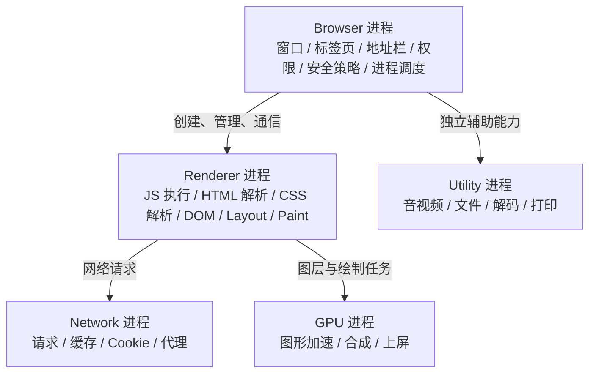
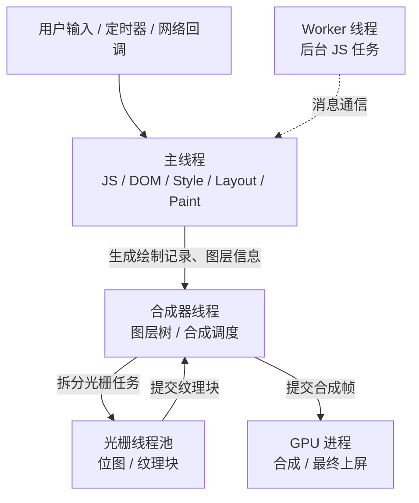
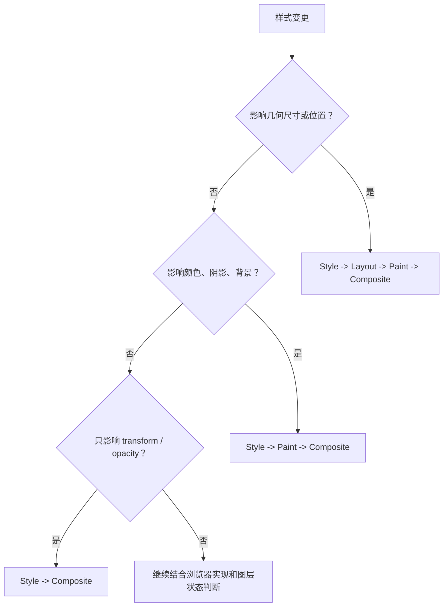
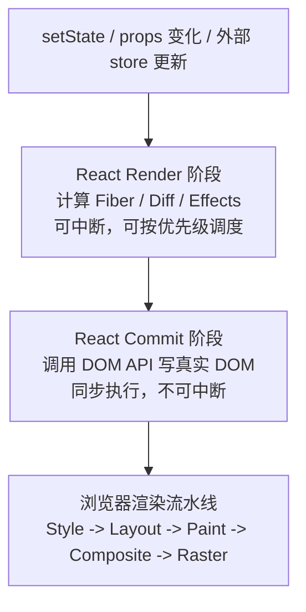
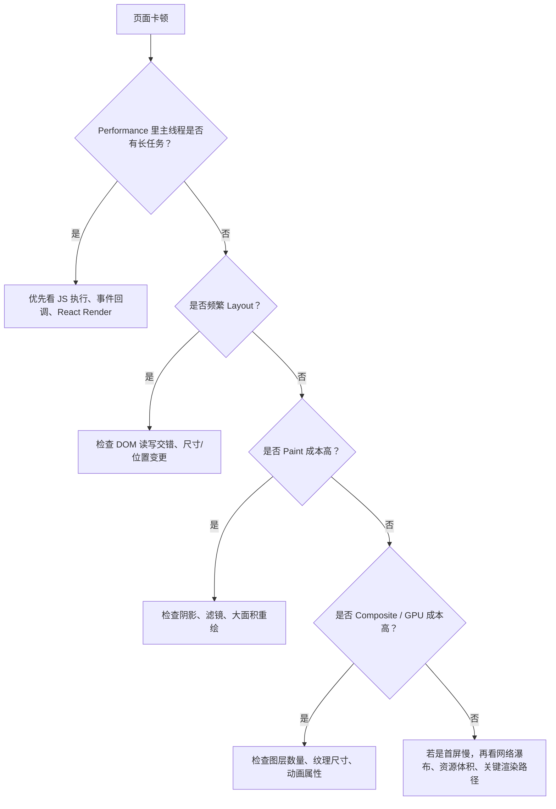

# 浏览器架构与前端渲染技术

理解前端渲染，核心不是背流程图，而是看清三层关系：

- 浏览器用多进程隔离页面、网络、GPU、插件等能力，提升稳定性和安全性。
- 单个页面的 JavaScript、DOM、样式计算和布局，主要发生在 Renderer 进程的主线程。
- 页面最终上屏会经过 Paint、Composite、Raster 等阶段，其中部分工作可以交给合成器线程、光栅线程和 GPU 进程处理。

一句话概括：**JS 改 DOM 是主线程上的同步工作，浏览器把页面绘制成像素则是多线程、多进程协作完成的。**

## 1. 浏览器的多进程架构

现代浏览器通常会把不同职责拆到不同进程中。以 Chromium 系浏览器为例，常见进程包括：

| 进程 | 主要职责 |
| --- | --- |
| Browser 进程 | 管理窗口、标签页、地址栏、权限、安全策略、进程调度 |
| Renderer 进程 | 执行页面 JS，解析 HTML/CSS，构建 DOM/CSSOM，负责页面渲染流水线 |
| GPU 进程 | 管理 GPU 资源，处理图形加速、合成提交、最终绘制相关工作 |
| Network 进程 | 处理网络请求、缓存、Cookie、代理等网络能力 |
| Utility 进程 | 承载音视频、文件、解码、打印等独立辅助能力 |

整体关系可以理解成这样：



### 一个 Tab 一定只有一个 Renderer 进程吗？

不一定。

- 普通同源页面通常对应一个 Renderer 进程。
- 页面内存在跨站 iframe 时，浏览器可能为不同站点分配不同 Renderer 进程。
- Browser 进程和 GPU 进程通常是浏览器级共享能力，不是每个 Tab 各自独占一份。

这种拆分的价值是：某个页面崩溃时，尽量不影响整个浏览器；跨站内容也可以通过进程隔离降低安全风险。

## 2. Renderer 进程里的线程模型

页面真正运行起来后，大量工作发生在 Renderer 进程内。常见线程包括：

| 线程 | 主要职责 |
| --- | --- |
| 主线程 | 执行 JavaScript，解析 HTML/CSS，构建 DOM/CSSOM，样式计算，布局，生成绘制记录 |
| 合成器线程 | 管理图层树、处理部分滚动和合成动画，向光栅线程或 GPU 提交合成任务 |
| 光栅线程池 | 将绘制记录转换为位图或纹理块 |
| IO 线程 | 处理与 Browser 进程、网络、输入事件等相关的进程通信 |
| Worker 线程 | 执行 Web Worker、Service Worker 等后台 JS 任务 |

Renderer 内部的协作可以简化成下面这张图：



主线程是性能瓶颈最常出现的位置。因为以下工作通常都要排队经过它：

- 执行 JS 逻辑
- 处理用户输入回调
- 修改 DOM 或 class
- 计算样式
- 执行布局
- 生成绘制记录

合成器线程可以绕开主线程处理一部分滚动和动画，但前提是相关内容已经被提升为可合成图层，并且不依赖主线程重新布局或重新绘制。因此，“JS 阻塞时滚动仍然流畅”不是绝对规律，而是有条件成立。

## 3. DOM 修改到页面上屏

一次典型的页面更新，大致会经历下面的流程：

```mermaid
flowchart TD
  js["JS 修改 DOM / class / style"]
  style["Style<br/>重新计算样式"]
  layout["Layout<br/>计算元素尺寸和位置"]
  paint["Paint<br/>生成绘制记录"]
  composite["Composite<br/>分层、排序、合成图层"]
  raster["Raster<br/>光栅化为像素或纹理"]
  display["Display<br/>提交到屏幕"]

  js --> style --> layout --> paint --> composite --> raster --> display
```

不是每次更新都会完整走完所有阶段。浏览器会尽量复用已有结果：

| 变更类型 | 常见影响 |
| --- | --- |
| 修改文本、尺寸、位置 | 可能触发 Style、Layout、Paint、Composite |
| 修改颜色、背景、阴影 | 通常跳过 Layout，但可能触发 Paint、Composite |
| 修改 `transform`、`opacity` | 理想情况下只触发 Composite |

可以用这张分支图快速判断一次样式变更的影响范围：



这也是前端性能优化常说的三句话：

- 少做 Layout：避免频繁读取和写入布局属性交错发生。
- 少做 Paint：大面积阴影、滤镜、背景重绘会增加绘制成本。
- 优先 Composite：动画优先使用 `transform` 和 `opacity`。

## 4. React 位于浏览器渲染链路的哪一层？

React 不会替代浏览器渲染引擎，它主要工作在浏览器主线程的 JavaScript 层。

React 的一次更新可以粗略分为两段：

| 阶段 | 发生位置 | 特点 |
| --- | --- | --- |
| Render 阶段 | JS 内存计算 | 构建 Fiber 树、执行 Diff、计算需要变更的内容，可被中断 |
| Commit 阶段 | 真实 DOM 写入 | 调用 DOM API，把变更提交给浏览器，不可中断 |

React 和浏览器渲染流水线的衔接关系如下：



Commit 之后，浏览器才继续接手 Style、Layout、Paint、Composite 等后续工作。

所以，虚拟 DOM 并不是因为“操作内存一定比操作 DOM 快”才有价值。它更重要的价值是：

- 用声明式方式描述 UI，降低手动维护 DOM 状态的复杂度。
- 把多次状态变化合并后再提交，减少不必要的真实 DOM 写入。
- 通过 Fiber 调度，把可中断的计算和不可中断的 DOM 提交区分开。
- 为跨平台渲染提供抽象层，例如 React DOM 和 React Native 使用不同宿主环境。

## 5. 为什么 React 不直接依赖 `requestIdleCallback`？

React 的调度需要稳定、可控、可分优先级。`requestIdleCallback` 有几个问题：

- 兼容性不足，不适合作为核心调度基础。
- 空闲时间不稳定，交互密集时回调可能迟迟不执行。
- `timeRemaining()` 精度有限，难以支撑复杂优先级调度。
- 很难表达“用户输入优先、页面过渡次之、后台渲染更低”的任务模型。

因此 React 自己实现 Scheduler，并常用 `MessageChannel` 等机制安排任务切片。这样可以更精确地控制任务执行、让出主线程，以及根据优先级恢复工作。

## 6. 性能分析时应该看什么？

排查页面卡顿时，可以先判断瓶颈发生在哪一层。

| 现象 | 可能原因 | 优先排查 |
| --- | --- | --- |
| 点击、输入延迟 | 主线程长任务、同步计算过重 | JS 执行时间、事件回调、React Render |
| 滚动卡顿 | 主线程阻塞、滚动区域需要重绘 | 长任务、滚动监听、复杂样式 |
| 动画掉帧 | Layout/Paint 成本高，或动画属性不适合合成 | 是否使用 `transform` / `opacity` |
| 首屏慢 | 网络、资源体积、JS 初始化、渲染阻塞 | 资源瀑布、bundle 体积、关键渲染路径 |
| 内存增长 | DOM 节点未释放、事件未解绑、缓存无限增长 | Heap Snapshot、Detached DOM |

排查顺序可以按下面的流程走：



一个实用判断是：如果 Performance 面板里主线程被长任务占满，优先优化 JS 和 React 更新；如果主线程压力不大但仍然掉帧，再重点看 Paint、Composite、图层和 GPU 相关成本。

## 7. 总结

- 浏览器是多进程架构，页面渲染主要发生在 Renderer 进程。
- JavaScript、DOM 修改、样式计算和布局通常都依赖主线程。
- 从 DOM 变化到最终上屏，会经过 Style、Layout、Paint、Composite、Raster 等阶段。
- `transform` 和 `opacity` 更容易走合成路径，适合承载高频动画。
- React 的 Render 阶段是 JS 内存计算，Commit 阶段才会写入真实 DOM。
- 虚拟 DOM 的核心价值不是“永远更快”，而是让 UI 更新更可预测、更容易调度、更容易跨平台。
