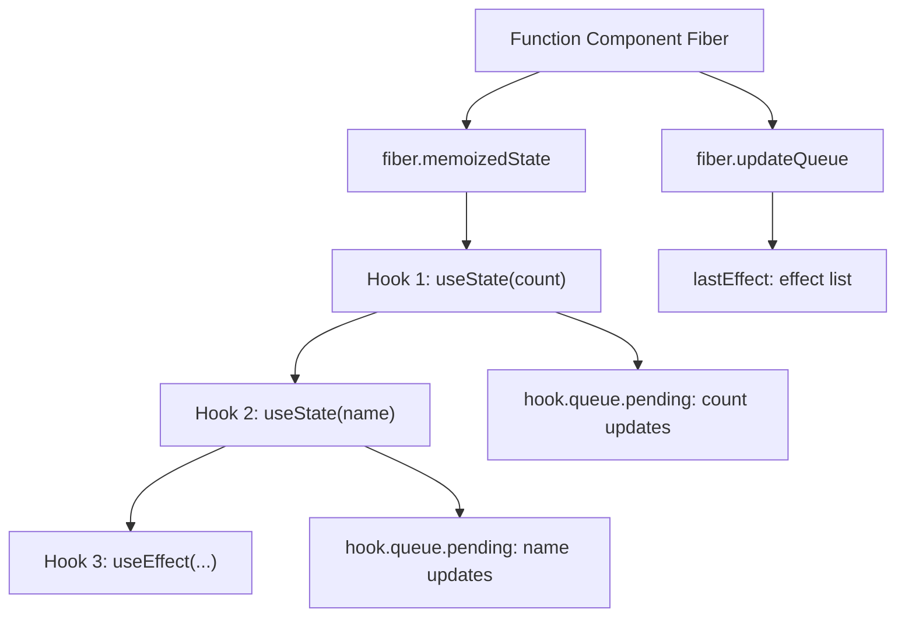
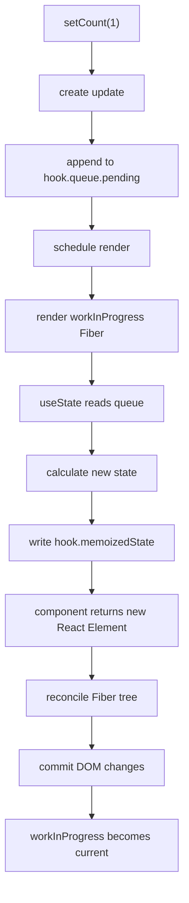

# React 执行流程问答总结

这篇文档记录一次关于 React 执行流程的讨论。目标不是背术语，而是把几个容易混在一起的概念拆开：`JSX`、`React Element`、虚拟 DOM、`Fiber`、真实 DOM、`render` 阶段和 `commit` 阶段。

## 问题一：这个 React 执行流程理解对吗

原始理解：

```text
首次执行：render 逐层执行 -> 构建 虚拟 Dom -> 遍历 虚拟 Dom -> 通常是 createElement
state 修改：更新虚拟Dom updateQueue
帧间渲染：遍历更新虚拟Dom（标记节点 增删改、updateQueue更新memoriesState等）-> commit ，执行原生DOM 修改、插入、删除操作并执行副作用
```

结论：**大方向是对的，但有几处说法需要修正。**

主要修正点：

- `setState` 不是直接更新虚拟 DOM，而是创建一次 update。函数组件的 `useState` 更新会先进入对应 Hook 的 `queue`。
- JSX 先变成 `React Element`，也就是描述 UI 的普通 JS 对象。
- React 内部真正用于调度、diff、记录状态和副作用的是 `Fiber`。
- `render` 阶段主要是在内存里算“哪里要变”。
- `commit` 阶段才是真的改 DOM、插入 DOM、删除 DOM，并执行相关副作用。
- 应该是 `memoizedState`，不是 `memoriesState`。
- “帧间渲染”这个说法不太准确，React 不一定每一帧都更新，而是根据调度优先级安排更新。

## 不说人话版本

更技术化的描述可以写成：

```text
首次渲染：
root.render(<App />)
  -> 执行组件函数
  -> 生成 React Element 树
  -> 基于 React Element 构建 Fiber 树
  -> reconciliation 阶段标记 Placement
  -> commit 阶段创建 / 插入真实 DOM
  -> 浏览器 paint
  -> 执行 passive effects，也就是 useEffect

state 更新：
setState / setXxx
  -> 创建 update 对象
  -> update 进入对应 Hook 的 queue
  -> 标记 lane，并调度一次 render
  -> render 阶段处理 Hook queue
  -> 计算新的 memoizedState
  -> 重新执行相关组件
  -> 生成新的 React Element
  -> reconciliation 新旧 Fiber
  -> 给 Fiber 打 flags：Placement / Update / Deletion
  -> commit 阶段执行真实 DOM 插入、更新、删除
  -> 处理 ref、useLayoutEffect、useEffect 等副作用
```

这个版本适合面试、写技术文章，或者你需要和 React 内部实现对齐时使用。

## 人话版本

更好理解的版本是：

```text
首次渲染：
React 先执行你的组件函数
  -> 组件返回 JSX
  -> JSX 变成一堆 JS 对象
  -> React 根据这些对象规划要创建哪些 DOM
  -> 最后一次性把真实 DOM 插到页面上
```

state 更新时：

```text
setState
  -> React 先记下来
  -> 找个合适时机重新执行组件
  -> 拿到新的 JSX
  -> 和上一次结果对比
  -> 找出哪里变了
  -> 最后只改真实 DOM 里需要改的地方
```

所以不是：

```text
setState -> 直接修改虚拟 DOM -> 直接修改 DOM
```

而是：

```text
setState
  -> 记录更新
  -> 重新 render
  -> 生成新的 React Element
  -> React 对比新旧结果
  -> commit 时修改真实 DOM
```

最短的人话：

```text
render 阶段：React 在草稿纸上算页面应该长什么样。
commit 阶段：React 真正把改动写到浏览器页面上。
```

## 问题二：什么叫创建一次 update

“创建一次 update”说人话就是：

```text
你调用 setState 的那一刻，React 不会马上改 state，也不会马上改 DOM。
它会先创建一条“更新记录”。
```

这条更新记录可以理解成一张小纸条：

```text
我要把 count 改成 1
```

或者：

```text
我要根据上一次 count，算出新的 count
```

比如：

```jsx
setCount(count + 1)
```

React 内部可以粗略理解成创建了一个 update：

```js
{
  action: count + 1
}
```

如果是函数式写法：

```jsx
setCount(prev => prev + 1)
```

可以粗略理解成：

```js
{
  action: prev => prev + 1
}
```

然后 React 会把这张“小纸条”放进队列里。

如果是函数组件里的 `useState`，它主要会进入这个 Hook 自己的队列：

```text
fiber.memoizedState -> hook.queue
```

下一次 render 时，React 才会按顺序处理这些 update。

比如连续写：

```jsx
setCount(prev => prev + 1)
setCount(prev => prev + 1)
setCount(prev => prev + 1)
```

可以理解成队列里有三张纸条：

```js
[
  { action: prev => prev + 1 },
  { action: prev => prev + 1 },
  { action: prev => prev + 1 }
]
```

下一次 render 时 React 再统一结算：

```js
let state = 0

state = state + 1 // 1
state = state + 1 // 2
state = state + 1 // 3
```

最后得到：

```js
count = 3
```

所以：

```text
创建一次 update = React 记录了一次“我要怎么改 state”的任务。
```

它不是马上改值。它是先记账，之后统一结算。

再短一点：

```text
setState 不是改值。
setState 是提交一条更新任务。
React 后面处理这个任务，才算出新 state。
```

补一句更严谨的：

```text
函数组件的 useState / useReducer 更新：
  update 放在 Hook.queue 里。

class 组件或 HostRoot 的更新：
  update 更接近放在 Fiber.updateQueue 里。
```

## 问题三：JSX 变成一堆 JS 对象，到底是什么对象

这里说的 JS 对象，就是 `React Element`。

比如写：

```jsx
const element = <div className="box">hello</div>
```

它大概会变成：

```js
{
  type: 'div',
  props: {
    className: 'box',
    children: 'hello'
  }
}
```

再比如：

```jsx
function App() {
  return (
    <div className="box">
      <h1>Hello</h1>
      <p>World</p>
    </div>
  )
}
```

它返回的结构可以理解成：

```js
{
  type: 'div',
  props: {
    className: 'box',
    children: [
      {
        type: 'h1',
        props: {
          children: 'Hello'
        }
      },
      {
        type: 'p',
        props: {
          children: 'World'
        }
      }
    ]
  }
}
```

这个对象不是 DOM。它只是描述：

```text
我要一个 div
class 是 box
里面有一个 h1
h1 里有 Hello
还有一个 p
p 里有 World
```

React 后面才会根据这份描述创建或更新真实 DOM。

## 问题四：React Element 不就是虚拟 DOM 的节点吗

结论：**对，学习层面可以这么理解。**

可以说：

```text
React Element = 虚拟 DOM 节点
```

但是更严谨的说法是：

```text
React Element 是虚拟 DOM 的描述节点；
Fiber 才是 React 内部真正拿来调度、diff、记录状态和提交更新的工作节点。
```

三者可以这样区分：

| 概念 | 人话理解 | 主要作用 |
| --- | --- | --- |
| React Element | 页面说明书 | 描述 UI 长什么样 |
| Fiber | 施工任务单 | 调度、diff、记录状态、记录副作用 |
| 真实 DOM | 浏览器页面里的真实节点 | 最终显示给用户 |

比如：

```jsx
<div className="box">hello</div>
```

可以理解为 React Element：

```js
{
  type: 'div',
  props: {
    className: 'box',
    children: 'hello'
  }
}
```

它描述了一个未来可能要创建的 DOM：

```html
<div class="box">hello</div>
```

所以：

```text
React Element 不是 DOM。
React Element 是 DOM 的描述。
Fiber 是 React 内部拿着这份描述去干活的工作节点。
```

## 问题五：memoizedState 和 updateQueue 到底长什么样

先说结论：

```text
memoizedState = 上次 render 算完后，React 留下来的结果。
updateQueue = 还没处理完，等着下次 render 结算的更新或副作用队列。
```

但是它们不是固定结构。不同类型的 Fiber 上，里面装的东西不一样。

### 函数组件的 fiber.memoizedState

函数组件里，`fiber.memoizedState` 存的是 Hooks 链表的头节点。

比如：

```jsx
function App() {
  const [count, setCount] = useState(0)
  const [name, setName] = useState('Tom')

  useEffect(() => {
    console.log(count)
  }, [count])

  return null
}
```

可以粗略理解成：

```js
fiber.memoizedState = hook1

hook1 = {
  memoizedState: 0,        // count 当前值
  baseState: 0,
  baseQueue: null,
  queue: stateQueue1,
  next: hook2,
}

hook2 = {
  memoizedState: 'Tom',    // name 当前值
  baseState: 'Tom',
  baseQueue: null,
  queue: stateQueue2,
  next: hook3,
}

hook3 = {
  memoizedState: effect,   // useEffect 的 effect 对象
  baseState: null,
  baseQueue: null,
  queue: null,
  next: null,
}
```

也就是说：

```text
fiber.memoizedState
  -> 第一个 Hook
      -> 第二个 Hook
          -> 第三个 Hook
```

这也是为什么 Hook 不能写在 `if` 里：React 是按调用顺序一个一个读这条链表的。顺序变了，它就会把上一个 Hook 的状态读到另一个 Hook 上。

### useState Hook 的 queue

对 `useState` 来说，真正存更新任务的是 Hook 自己的 `queue`。

可以粗略理解成：

```js
stateQueue = {
  pending: null,              // 等待处理的 update，通常可以理解成环形链表
  lanes: NoLanes,             // 这批更新的优先级
  dispatch: setCount,         // 你代码里拿到的 setCount
  lastRenderedReducer: basicStateReducer,
  lastRenderedState: 0,
}
```

你调用：

```jsx
setCount(count + 1)
```

React 会创建一条 update：

```js
update = {
  lane,                       // 本次更新的优先级
  action: count + 1,          // 也可能是 prev => prev + 1
  hasEagerState: false,
  eagerState: null,
  next: null,
}
```

然后把它挂到：

```text
hook.queue.pending
```

所以 `useState` 更新不是立刻改：

```text
hook.memoizedState
```

而是先放进：

```text
hook.queue.pending
```

下一次 render 时再统一算。

### 函数组件的 fiber.updateQueue

这里容易混：

```text
函数组件的 state 更新队列，不主要放在 fiber.updateQueue。
```

函数组件的 `fiber.updateQueue` 更常见的是放 effect 相关数据。

可以粗略理解成：

```js
fiber.updateQueue = {
  lastEffect: effect,
  events: null,
  stores: null,
  memoCache: null,
}
```

所以可以这样记：

```text
useState 的更新：
  fiber.memoizedState -> hook.queue

useEffect 的副作用：
  fiber.updateQueue.lastEffect
```

### class 组件或 root 的 fiber.updateQueue

如果是 class 组件或者 HostRoot，`fiber.updateQueue` 才更像直觉里的“组件更新队列”。

大概长这样：

```js
fiber.updateQueue = {
  baseState,
  firstBaseUpdate,
  lastBaseUpdate,
  shared: {
    pending,
    lanes,
    hiddenCallbacks,
  },
  callbacks,
}
```

一张图串起来：



最短版：

```text
fiber.memoizedState：
  对函数组件来说，是 Hook 链表的头。

hook.memoizedState：
  这个 Hook 当前保存的值。

hook.queue：
  useState / useReducer 等待处理的更新。

fiber.updateQueue：
  函数组件里多用于 effect；
  class/root 里更像组件级 update 队列。
```

## 问题六：重新执行组件时，会更新 memoizedState 吗

会。

但准确说，是在本次 render 过程里更新 `workInProgress` 那棵 Fiber 上的 `memoizedState`，不是直接改已经显示在页面上的 current Fiber。

先看常见说法：

```text
setState
  -> React 重新执行组件
  -> 得到新的 React Element
```

这里中间其实少了一步：

```text
setState
  -> 创建 update，放进 Hook.queue
  -> React 调度 render
  -> 准备 workInProgress Fiber
  -> 重新执行组件
      -> 执行 useState
      -> 处理 Hook.queue 里的 update
      -> 算出新 state
      -> 写入 workInProgress Hook.memoizedState
  -> 组件函数继续执行
  -> 用新 state 得到新的 React Element
```

所以不是：

```text
先得到新的 React Element
再更新 memoizedState
```

而是：

```text
执行组件函数时，Hook 先算出新的 state。
组件后面的 JSX 用这个新 state 返回新的 React Element。
```

比如：

```jsx
function Counter() {
  const [count, setCount] = useState(0)

  return <button onClick={() => setCount(1)}>{count}</button>
}
```

第一次 render：

```text
hook.memoizedState = 0
返回 <button>0</button>
```

点击后：

```text
setCount(1)
  -> 创建 update: { action: 1 }
  -> update 进入 hook.queue.pending
```

下一次 render 重新执行 `Counter()`。

当代码执行到：

```jsx
const [count, setCount] = useState(0)
```

React 内部可以粗略理解成：

```js
oldState = hook.memoizedState
update = hook.queue.pending

newState = update.action

hook.memoizedState = newState

return [hook.memoizedState, dispatch]
```

于是组件后面拿到的 `count` 已经是 `1`：

```jsx
return <button>{count}</button>
```

最终返回的新 React Element 可以理解成：

```js
{
  type: 'button',
  props: {
    children: 1
  }
}
```

这里再补一个重要点：

```text
current Fiber.memoizedState：
  上一次 commit 后，页面当前使用的 Hook 链表。

workInProgress Fiber.memoizedState：
  本次 render 正在计算的新 Hook 链表。
```

本次 render 如果成功 commit：

```text
workInProgress 会变成新的 current。
```

如果本次 render 被中断或丢弃：

```text
页面上 current 的 memoizedState 不会被这次未提交结果替换。
```

流程可以画成：



最短答案：

```text
有更新 memoizedState。
它发生在重新执行组件期间，具体是在 Hook 被调用、处理 queue 的时候。
新的 React Element 是用更新后的 state 算出来的。
```

## 最终推荐理解

可以记这条完整链路：

```text
JSX
  -> React Element，也就是虚拟 DOM 描述
  -> Fiber，React 内部工作树
  -> DOM 操作
  -> 浏览器显示
```

首次渲染：

```text
执行组件函数
  -> 得到 React Element
  -> 构建 Fiber 树
  -> commit 创建真实 DOM
```

state 更新：

```text
setState
  -> 更新进入 Hook.queue
  -> React 重新执行组件
  -> Hook 处理 queue，更新 workInProgress.memoizedState
  -> 得到新的 React Element
  -> 更新 Fiber 树并标记变化
  -> commit 修改真实 DOM
```

最短版：

```text
JSX 是你写的。
React Element 是 JSX 变出来的虚拟 DOM 描述。
Fiber 是 React 内部真正工作的树。
DOM 是最后真的显示在浏览器里的东西。
render 负责算。
commit 负责改。
```

## 一个小例子串起来

代码：

```jsx
function Counter() {
  const [count, setCount] = React.useState(0)

  return (
    <button onClick={() => setCount(count + 1)}>
      {count}
    </button>
  )
}
```

首次渲染时：

```text
执行 Counter()
  -> count 是 0
  -> 返回 <button>0</button>
  -> React 创建对应 Fiber
  -> commit 创建真实 button
  -> 页面显示 0
```

点击按钮时：

```text
执行 setCount(1)
  -> React 记录一次 state 更新
  -> 重新执行 Counter()
  -> count 变成 1
  -> 返回 <button>1</button>
  -> React 对比上次的 <button>0</button>
  -> 发现只是文本从 0 变成 1
  -> commit 阶段只更新按钮文本
```

这就是 React 的核心工作方式：**组件重新执行，但 DOM 不一定全部重建；React 会先算，再只改必要的部分。**
